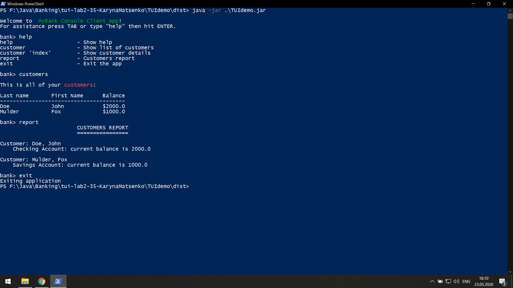

# Результат

## Завдання 
На "п'ять" 
1. Додайте ще одну команду - report, яка має виводити звіт за клієнтами такого ж виду, як у роботі номер 8 (див. CustomerReport).
2. Запустіть проект, впевніться, що все працює як очікувалось. Продемонстрируйте результат викладачеві.
